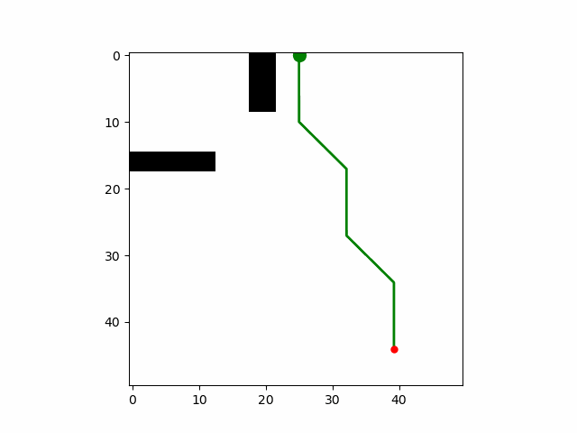
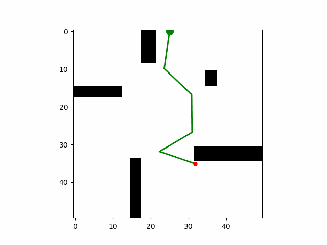

# Algorithms
This contains implementation of 4 sampling based algorithms
1. RRT
2. RRT-Connect
3. RRT*
4. PRM

The objective of the planning is for the arm to move from start joint angles to goal joint angles.
Here states of the system are defined by joint angles.

# Results
1. The planner is tested on 2 different maps. A comprehensive planner comparison is underway and I will update is shortly.

Following are GiFs for the results from planners.

1. RRT 

2. RRT-Connect

3. RRT*

4. PRM

# Introduction
This repository contains implementations of materials in Planning and Decision making course at CMU. 
Hence, All the planner codes were written as part of Planning and decision making course from scratch. Please refer to academic Integrity policy of CMU before using/referring these codes.

